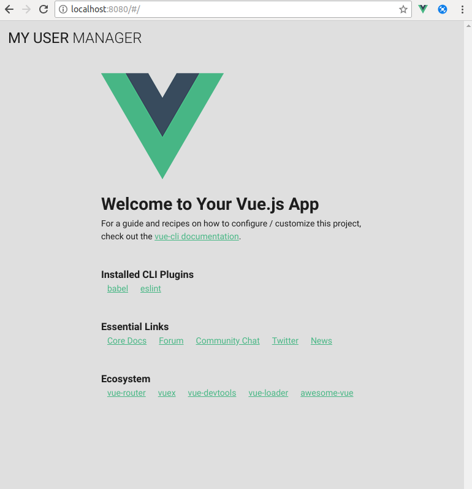

# App

## Desarrollo

Para comenzar debemos adaptar el componente principal de la aplicación `src/App.vue` a [vuetify].

**src/App.vue**

```html
<template>
  <v-app>
    <v-toolbar color="grey lighten-2" flat app id="nav">
      <v-toolbar-title class="headline text-uppercase">
        <span>My User </span>
        <span class="font-weight-light">Manager</span>
      </v-toolbar-title>
    </v-toolbar>

    <v-content class="grey lighten-2">
      <v-container>
        <v-layout
          justify-center
          align-center
        >
          <router-view/>
        </v-layout>
      </v-container>
    </v-content>
  </v-app>
</template>
```



[vue]: https://vuetifyjs.com/en/
[vue cli]: https://cli.vuejs.org/
[vue router]: https://router.vuejs.org/
[vuex]: https://vuex.vuejs.org/guide/
[vuetify]: https://vuetifyjs.com/en/
[ESLint]: https://eslint.org/
