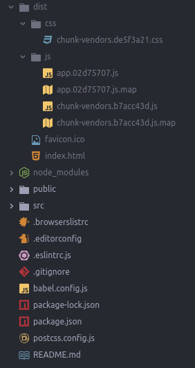

# Desplegar aplicación

El despliegue de la aplicación se realiza mediante el comando `build`, que genera la carpeta `dist` con el contenido de la aplicación.

```shell
$ npm run build
```

```shell
> example4@0.1.0 build _path_/example
> vue-cli-service build


⠼  Building for production...

 WARNING  Compiled with 3 warnings                                                11:21:37

 warning

asset size limit: The following asset(s) exceed the recommended size limit (244 KiB).
This can impact web performance.
Assets:
  js/chunk-vendors.b7acc43d.js (285 KiB)

 warning

entrypoint size limit: The following entrypoint(s) combined asset size exceeds the recommended limit (244 KiB). This can impact web performance.
Entrypoints:
  app (458 KiB)
      css/chunk-vendors.de5f3a21.css
      js/chunk-vendors.b7acc43d.js
      js/app.02d75707.js


 warning

webpack performance recommendations:
You can limit the size of your bundles by using import() or require.ensure to lazy load some parts of your application.
For more info visit https://webpack.js.org/guides/code-splitting/

  File                                   Size              Gzipped

  dist/js/chunk-vendors.b7acc43d.js      284.96 kb         86.83 kb
  dist/js/app.02d75707.js                9.87 kb           3.46 kb
  dist/css/chunk-vendors.de5f3a21.css    163.26 kb         21.39 kb

  Images and other types of assets omitted.

 DONE  Build complete. The dist directory is ready to be deployed.
 INFO  Check out deployment instructions at https://cli.vuejs.org/guide/deployment.html
```

La carpeta contiene los ficheros `js` y `css` generados durante el `build` del proyecto, así como el index.html con la configuración necesaria para cargar la aplicación.



**dist/index.html**

```html
<!DOCTYPE html>
<html lang=en>

<head>
    <meta charset=utf-8>
    <meta http-equiv=X-UA-Compatible content="IE=edge">
    <meta name=viewport content="width=device-width,initial-scale=1">
    <link rel=icon href=/favicon.ico>
    <title>example</title>
    <link rel=stylesheet href="https://fonts.googleapis.com/css?family=Roboto:100,300,400,500,700,900">
    <link rel=stylesheet href="https://fonts.googleapis.com/css?family=Material+Icons">
    <link href=/css/chunk-vendors.de5f3a21.css rel=preload as=style>
    <link href=/js/app.02d75707.js rel=preload as=script>
    <link href=/js/chunk-vendors.b7acc43d.js rel=preload as=script>
    <link href=/css/chunk-vendors.de5f3a21.css rel=stylesheet>
</head>

<body>
    <noscript><strong>We're sorry but example doesn't work properly without JavaScript enabled. Please enable it to continue.</strong></noscript>
    <div id=app></div>
    <script src=/js/chunk-vendors.b7acc43d.js></script>
    <script src=/js/app.02d75707.js></script>
</body>

</html>
```
