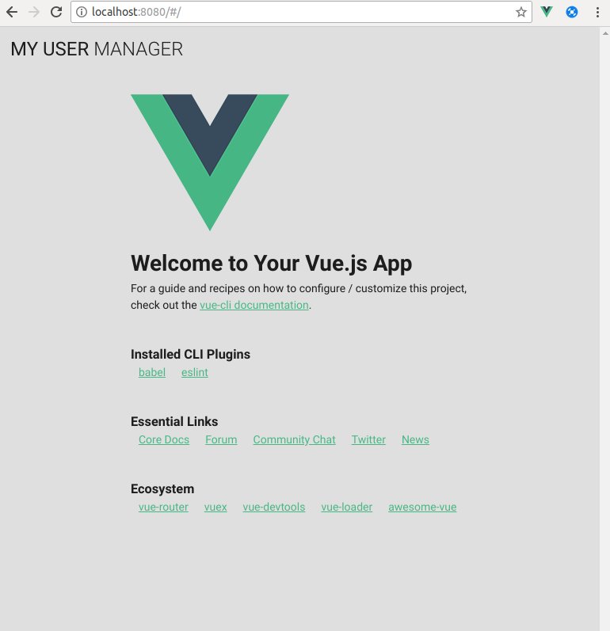

# Instalación

## vue cli

Se requiere instalar previamente la version 3 de [vue cli].

```shell
$ sudo npm install -g @vue/cli
```

## Creación del proyecto vue

Una vez instalado podemos generar el nuevo proyecto [vue] con el comando `vue create`.

```shell
$ vue create example

Vue CLI v3.1.3
? Please pick a preset: (Use arrow keys)
  default (babel, eslint)
❯ Manually select features


Vue CLI v3.1.3
? Please pick a preset: Manually select features
? Check the features needed for your project: Babel, Router, Vuex, Linter
? Use history mode for router? (Requires proper server setup for index fallback in production) No
? Pick a linter / formatter config: Standard
? Pick additional lint features: Lint on save
? Where do you prefer placing config for Babel, PostCSS, ESLint, etc.? In dedicated config files
? Save this as a preset for future projects? No


Vue CLI v3.1.3
✨  Creating project in _path_/example.
⚙  Installing CLI plugins. This might take a while...


> yorkie@2.0.0 install _path_/example/node_modules/yorkie
> node bin/install.js

setting up Git hooks
can't find .git directory, skipping Git hooks installation
added 1109 packages in 21.611s
🚀  Invoking generators...
📦  Installing additional dependencies...

added 54 packages, updated 2 packages and moved 5 packages in 10.913s
⚓  Running completion hooks...

📄  Generating README.md...

🎉  Successfully created project example.
👉  Get started with the following commands:

 $ cd example
 $ npm run serve
```

El proyecto generado contiene dos ventanas _Home_ y _About_ controladas por [vue router] y un store controlado por [vuex].

**Home**


**About**


Estructura inicial de carpetas creada por el vue.


El fichero principal de la aplicación vue se encuentra en `src/main.js`. En éste fichero se configura y crea el objeto vue.

**src/main.js**

```javascript
import Vue from 'vue'
import App from './App.vue'
import router from './router'
import store from './store'

Vue.config.productionTip = false

new Vue({
  router,
  store,
  render: h => h(App)
}).$mount('#app')

```

## Instalar Vuetify

En este caso se ha escogido [vuetify] como framework de componentes ya que está basado en _Material Design_.


El nuevo cli de vue facilita la instalación de [vuetify].

```shell
$ vue add vuetify

📦  Installing vue-cli-plugin-vuetify...


> yorkie@2.0.0 install _path_/example/node_modules/yorkie
> node bin/install.js

setting up Git hooks
can't find .git directory, skipping Git hooks installation
+ vue-cli-plugin-vuetify@0.4.6
added 1164 packages in 12s
✔  Successfully installed plugin: vue-cli-plugin-vuetify

? Choose a preset: Configure (advanced)
? Use a pre-made template? (will replace App.vue and HelloWorld.vue) No
? Use custom theme? No
? Use custom properties (CSS variables)? No
? Select icon font Material Icons
? Use fonts as a dependency (for Electron or offline)? No
? Use a-la-carte components? Yes
? Select locale English

🚀  Invoking generator for vue-cli-plugin-vuetify...
📦  Installing additional dependencies...

added 12 packages in 7.974s
⚓  Running completion hooks...

✔  Successfully invoked generator for plugin: vue-cli-plugin-vuetify
   The following files have been updated / added:

     src/plugins/vuetify.js
     package-lock.json
     package.json
     public/index.html
     src/main.js

   You should review these changes with git diff and commit them.
```

La estructura del proyecto una vez añadido [vuetify] sería la siguiente.


Al ejecutarse encontramos un error detectado por [ESLint].

```shell
npm run serve

> example@0.1.0 serve _path_/example
> vue-cli-service serve

 INFO  Starting development server...
 98% after emitting CopyPlugin

 WARNING  Compiled with 1 warnings

Module Warning (from ./node_modules/eslint-loader/index.js):
error: Unexpected trailing comma (comma-dangle) at src/plugins/vuetify.js:6:17:
  4 |
  5 | Vue.use(Vuetify, {
> 6 |   iconfont: 'md',
    |                 ^
  7 | })
  8 |


1 error found.
1 error potentially fixable with the `--fix` option.

You may use special comments to disable some warnings.
Use // eslint-disable-next-line to ignore the next line.
Use /* eslint-disable */ to ignore all warnings in a file.

  App running at:
  - Local:   http://localhost:8080/
  - Network: http://192.168.0.24:8080/

  Note that the development build is not optimized.
  To create a production build, run npm run build.
```

### ESLint

Gracias al comando `lint` configurado en el proyecto [vue] podemos controlar y arreglar los errores de calidad de código en el proyecto.

```shell
$ npm run lint

> example@0.1.0 lint _path_/example
> vue-cli-service lint

The following files have been auto-fixed:

  src/plugins/vuetify.js

 DONE  All lint errors auto-fixed.
```

```shell
$ npm run serve

> example@0.1.0 serve _path_/example
> vue-cli-service serve

 INFO  Starting development server...
 98% after emitting CopyPlugin

 DONE  Compiled successfully in 14557ms


  App running at:
  - Local:   http://localhost:8080/
  - Network: http://192.168.0.24:8080/

  Note that the development build is not optimized.
  To create a production build, run npm run build.
```



[vue]: https://vuetifyjs.com/en/
[vue cli]: https://cli.vuejs.org/
[vue router]: https://router.vuejs.org/
[vuex]: https://vuex.vuejs.org/guide/
[vuetify]: https://vuetifyjs.com/en/
[ESLint]: https://eslint.org/
