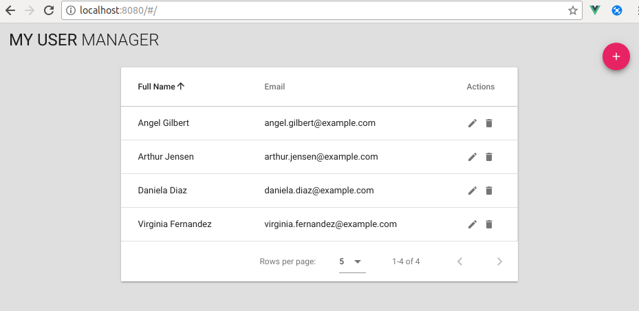

# Crear Usuario

## Desarrollo

### Añadir botón para crear usuario

Se modifica `src/App.vue` para que muestre un botón que permita crear usuarios.

**src/App.vue**

```html
<template>
  <v-app>
    <v-toolbar color="grey lighten-2" flat app id="nav">
      <v-toolbar-title class="headline text-uppercase">
        <span>My User </span>
        <span class="font-weight-light">Manager</span>
      </v-toolbar-title>
      <v-spacer></v-spacer>
      <v-btn
        color="pink"
        fab
        dark
        small
        absolute
        bottom
        right
        @click="onCreateUser">
        <v-icon>add</v-icon>
      </v-btn>
    </v-toolbar>
    ...
  </v-app>
</template>

<script>
export default {
  methods: {
    onCreateUser () {
      this.$router.push({ name: 'newUser' })
    }
  }
}
</script>
```

**src/router.js**
```javascript
...
export default new Router({
  routes: [
    {
      path: '/',
      name: 'home',
      component: Home,
      children: [
        { path: 'new', component: UserForm, name: 'newUser' },
        { path: ':userId', component: UserForm, name: 'editUser' }
      ]
    }
  ]
})
```



### Crear usuario

Se crea la gestión de la petición `POST` y se añade la acción en el store.

**src/api.js**

```javascript
...
export const createUser = (user) => {
  return instance.post('/users', user)
}
...
```

**src/store/userForm.js**

```javascript
import { getUserById, updateUserById, createUser } from '@/api'

export default {
  ...
  actions: {
    ...
    create ({ commit }, user) {
      return new Promise((resolve, reject) => {
        createUser(user)
          .then(response => {
            return resolve(response.data)
          })
          .catch((err) => {
            return reject(err)
          })
      })
    }
  },
  ...
}
```

**src/store/usersList.js**

```javascript
...
export default {
  ...
  mutations: {
    ...
    ADD_ITEM (state, user) {
      state.list.push(user)
    },
    ...
  },
  actions: {
    ...
    insert ({ commit }, user) {
      return new Promise(resolve => {
        commit('ADD_ITEM', user)
        return resolve()
      })
    },
    ...
  },
  ...
}
```

### Adaptar componente `UserForm`

Con el objetivo de reutilizar el componente se definen desde `router` las propiedades `title` y `create` para adaptar al componente.

**src/router.js**

```javascript
        { path: 'new', component: UserForm, name: 'newUser', props: { title: 'New User Profile', create: true } },
```

En el componente `UserForm` se definen las propiedades y se implementan las funcionalidades para permitir crear usuarios.

**src/components/UserForm.vue**

```html
<template>
  <v-dialog
    v-model="dialog"
    persistent
    width="500"
   >
    <v-card>
      <v-card-title>
        <span class="headline">{{ title }}</span>
      </v-card-title>
      ...
      <v-card-actions>
        ...
        <v-btn
          v-if="create"
          color="pink"
          @click="onCreate"
          >Create
        </v-btn>
        <v-btn
          v-else
          :loading="saving"
          :disabled="saving"
          color="orange"
          @click="onSave"
          >Save
          <span slot="loader">Saving...</span>
        </v-btn>
      </v-card-actions>
    </v-card>
  </v-dialog>
</template>

<script>
export default {
  ...
  props: {
    title: { type: String, default: 'User Profile' },
    create: { type: Boolean, default: false }
  },
  methods: {
    ...
    onCreate () {
      this.errorAlert = undefined
      this.$store.dispatch('userForm/create', this.user)
        .then(user => {
          return this.$store.dispatch('usersList/insert', user)
        })
        .then(() => {
          this.$router.go(-1)
        })
        .catch(() => {
          this.errorAlert = 'Error creating user'
        })
    }
    ...
  },
  ...
  mounted () {
    let userId = this.$route.params.userId
    if (userId) this.$store.dispatch('userForm/load', userId)
  },
  ...
}
</script>
```
