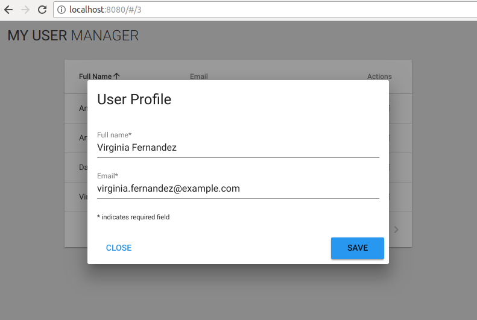

# Editar Usuario

## Desarrollo

### Cargar información del usuario

En primer lugar añadimos la acción `GET` a `api.js`.

**src/api.js**

```javascript
...
export const getUserById = (id) => {
  return instance.get(`/users/${id}`)
}
...
```

Se crea el módulo `userForm` y se carga en el store.

**src/store/userForm.js**

```javascript
import { getUserById } from '@/api'

export default {
  namespaced: true,
  state: {
    id: undefined,
    name: undefined,
    email: undefined,
    loading: false
  },
  mutations: {
    SET_NAME (state, name) {
      state.name = name
    },
    SET_EMAIL (state, email) {
      state.email = email
    },
    SET_USER (state, user) {
      state.id = user.id
      state.name = user.name
      state.email = user.email
    },
    EMPTY_USER (state) {
      state.id = undefined
      state.name = undefined
      state.email = undefined
      state.loading = false
    },
    LOADING (state, value) {
      state.loading = value
    }
  },
  actions: {
    load ({ commit }, userId) {
      commit('LOADING', true)
      return new Promise(resolve => {
        getUserById(userId)
          .then(response => {
            commit('SET_USER', response.data)
            commit('LOADING', false)
            resolve()
          })
      })
    }
  },
  getters: {
    user: state => {
      return {
        id: state.id,
        name: state.name,
        email: state.email
      }
    },
    loading: state => state.loading
  }
}
```

**src/store/index.js**

```javascript
import Vue from 'vue'
import Vuex from 'vuex'

import usersList from './usersList'
import userForm from './userForm'

Vue.use(Vuex)

export default new Vuex.Store({
  modules: {
    usersList,
    userForm
  }
})
```

### Componente `UserForm`

Se crea el fichero `src/components/UserForm.vue` para definir el formulario que permitirá editar los usuarios.

**src/components/UserForm.vue**

```html
<template>
  <v-dialog
    v-model="dialog"
    persistent
    width="500"
   >
    <v-card>
      <v-card-title>
        <span class="headline">User Profile</span>
      </v-card-title>
      <v-card-text>
        <div class="text-xs-center" v-if="loading">
          <v-progress-linear indeterminate></v-progress-linear>
        </div>
        <template v-else>
          <form>
            <v-text-field
              label="Full name*"
              v-model="name"
              required
              ></v-text-field>
            <v-text-field
              label="Email*"
              v-model="email"
              required
              ></v-text-field>
          </form>
          <small>* indicates required field</small>
        </template>
      </v-card-text>
      <v-card-actions>
        <v-btn
          flat
          @click="onClose"
          >Close</v-btn>
        <v-spacer></v-spacer>
        <v-btn
          color="orange"
          @click="onSave"
          >Save</v-btn>
      </v-card-actions>
    </v-card>
  </v-dialog>
</template>

<script>
export default {
  data () {
    return {
      dialog: true
    }
  },
  methods: {
    onClose () {
      this.$router.go(-1)
    },
    onSave () {
      console.log('save')
    }
  },
  computed: {
    loading: {
      get () {
        return this.$store.getters['userForm/loading']
      }
    },
    user: {
      get () {
        return this.$store.getters['userForm/user']
      }
    },
    name: {
      get () {
        return this.$store.state.userForm.name
      },
      set (value) {
        return this.$store.commit('userForm/SET_NAME', value)
      }
    },
    email: {
      get () {
        return this.$store.state.userForm.email
      },
      set (value) {
        return this.$store.commit('userForm/SET_EMAIL', value)
      }
    }
  },
  mounted () {
    let userId = this.$route.params.userId
    this.$store.dispatch('userForm/load', userId)
  },
  beforeDestroy () {
    this.$store.commit('userForm/EMPTY_USER')
  }
}
</script>
```

El componente se va a mostrar como un modal sobre el listado, para ello debemos añadir un componente `router-view` en el listado y configurar el `router`.

**src/components/UsersList.vue**

```html
<template>
<div class="user-list">
  <v-data-table
    :headers="headers"
    :items="users"
    class="elevation-1"
    :loading="loading"
  >
    ...
  </v-data-table>
  <router-view />
</div>
</template>

<script>
export default {
  ...
  methods: {
    onEdit (user) {
      let userId = user.id
      this.$router.push({ name: 'editUser', params: { userId } })
    },
    ...
  },
  ...
}
</script>
```

**src/router.js**

```javascript
import Vue from 'vue'
import Router from 'vue-router'
import Home from './views/Home.vue'
import UserForm from './components/UserForm.vue'

Vue.use(Router)

export default new Router({
  routes: [
    {
      path: '/',
      name: 'home',
      component: Home,
      children: [
        { path: ':userId', component: UserForm, name: 'editUser' }
      ]
    }
  ]
})
```

Por último se actualiza el módulo del store `usersList` para permitir actualizar los usuarios cargados.

**src/store/usersList.js**

```javascript
...
export default {
  ...
  mutations: {
    ...
    UPDATE_ITEM (state, user) {
      state.list = state.list.map(u => {
        if (u.id !== user.id) return u
        return Object.assign({}, user)
      })
    },
    ...
  },
  actions: {
    ...
    update ({ commit }, user) {
      return new Promise(resolve => {
        commit('UPDATE_ITEM', user)
        return resolve()
      })
    },
    ...
  },
  ...
}
```



### Guardar cambios

Se configura la petición `PUT` en `api.js` y se añade la acción al módulo del store `userForm`.

**src/api.js**

```javascript
...
export const updateUserById = (user) => {
  return instance.put(`/users/${user.id}`, user)
}
...
```

**src/store/userForm.js**

```javascript
import { getUserById, updateUserById } from '@/api'

export default {
  namespaced: true,
  ...
  },
  actions: {
    ...
    save ({ commit }, user) {
      return new Promise(resolve => {
        updateUserById(user)
          .then(response => {
            return resolve(response.data)
          })
      })
    }
  },
  ...
}
```

Se ejecuta la acción definida en el método `onSave` del componente 'UserForm'.

**src/components/UserForm.vue**

```html
<template>
  ...
</template>

<script>
export default {
  data () {
    return {
      dialog: true
    }
  },
  methods: {
    ...
    onSave () {
      this.$store.dispatch('userForm/save', this.user)
        .then(user => {
          return this.$store.dispatch('usersList/update', user)
        })
        .then(() => {
          this.$router.go(-1)
        })
    }
  },
  ...
}
</script>
```

### Mensaje de error al guardar

Se mostrará una alerta de error ante cualquier error que se reciba en la petición.

**src/components/UserForm.vue**

```html
<template>
  <v-dialog
    v-model="dialog"
    persistent
    width="500"
   >
    <v-card>
      ...
      <v-card-text>
        <v-alert
          :value="!!errorAlert"
          type="error"
          transition="scale-transition"
        > {{ errorAlert }}
        </v-alert>
        ...
      </v-card-text>
      ...
    </v-card>
  </v-dialog>
</template>

<script>
export default {
  data () {
    return {
      dialog: true,
      errorAlert: undefined
    }
  },
  methods: {
    ...
    onSave () {
      this.errorAlert = undefined
      this.$store.dispatch('userForm/save', this.user)
        .then(user => {
          return this.$store.dispatch('usersList/update', user)
        })
        .then(() => {
          this.$router.go(-1)
        })
        .catch(() => {
          this.errorAlert = 'Error saving user'
        })
    }
  },
  ...
}
</script>
```

### Botón `SAVE`

Se cambia el texto en el botón de guardado para mejorar la experiencia del usuario con la aplicación. Para ello se define una nueva propiedad en el módulo `userForm` y se actualiza el componente `UserForm`.

**src/store/userForm.js**

```javascript
...
export default {
  namespaced: true,
  state: {
    ...
    saving: false
  },
  mutations: {
    ...
    EMPTY_USER (state) {
      ...
      state.saving = false
    },
    ...
    SAVING (state, value) {
      state.saving = value
    }
  },
  actions: {
    ...
    save ({ commit }, user) {
      commit('SAVING', true)
      return new Promise((resolve, reject) => {
        updateUserById(user)
          .then(response => {
            commit('SAVING', false)
            return resolve(response.data)
          })
          .catch((err) => {
            commit('SAVING', false)
            return reject(err)
          })
      })
    }
  },
  ...
}
```

**src/components/UserForm.vue**

```html
<template>
  <v-dialog
    v-model="dialog"
    persistent
    width="500"
   >
    <v-card>
      ...
      <v-card-actions>
        ...
        <v-btn
          :loading="saving"
          :disabled="saving"
          color="orange"
          @click="onSave"
          >Save
          <span slot="loader">Saving...</span>
        </v-btn>
      </v-card-actions>
    </v-card>
  </v-dialog>
</template>

<script>
export default {
  ...
  methods: {
    ...
    onSave () {
      this.errorAlert = undefined
      this.$store.dispatch('userForm/save', this.user)
        .then(user => {
          return this.$store.dispatch('usersList/update', user)
        })
        .then(() => {
          this.$router.go(-1)
        })
        .catch(() => {
          this.errorAlert = 'Error saving user'
        })
    }
  },
  computed: {
    ...
    saving: {
      get () {
        return this.$store.getters['userForm/saving']
      }
    },
    ...
  },
  ...
}
</script>
```
