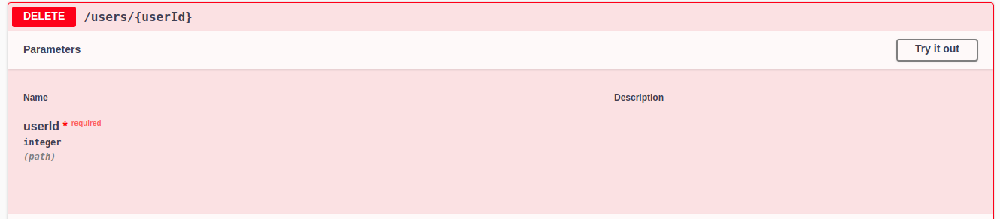

# Eliminar Usuario

## Descripción

Eliminar un usuario utilizado el servicio REST a través de la petición `DELETE /users/{userId}`.



## Desarrollo

Se añade la acción de eliminar usuario al fichero del API y al módulo `usersList` del store.

**src/api.js**

```javascript
...
export const deleteUserById = (id) => {
  return instance.delete(`/users/${id}`)
}
...
```

**src/store/usersList.js**

```javascript
import { getUsers, deleteUserById } from '@/api'

export default {
  ...
  mutations: {
    ...
    REMOVE_ITEM (state, id) {
      state.list = state.list.filter(x => x.id !== id)
    }
  },
  actions: {
    ...
    remove ({ commit }, id) {
      commit('LOADING', true)
      return new Promise(resolve => {
        deleteUserById(id)
          .then(() => {
            commit('REMOVE_ITEM', id)
            commit('LOADING', false)
            resolve()
          })
      })
    }
  },
  ...
}

```

Por último se ejecuta la acción definida en el método `onRemove` definido en el componente `UsersList`.

**src/components/UsersList.vue**

```html
...
<script>
export default {
  ...
  methods: {
    ...
    onRemove (user) {
      this.$store.dispatch('usersList/remove', user.id)
    }
  },
  ...
}
</script>
```
