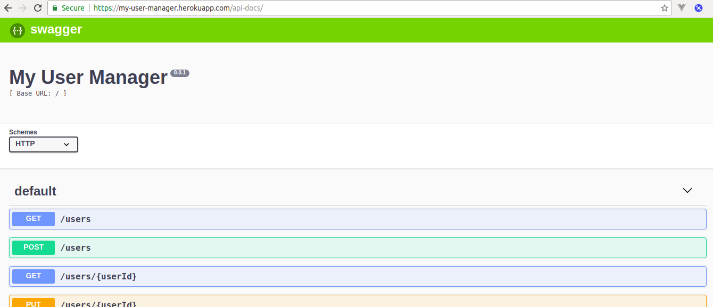
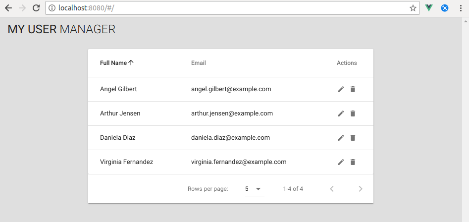
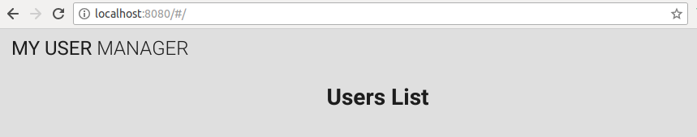
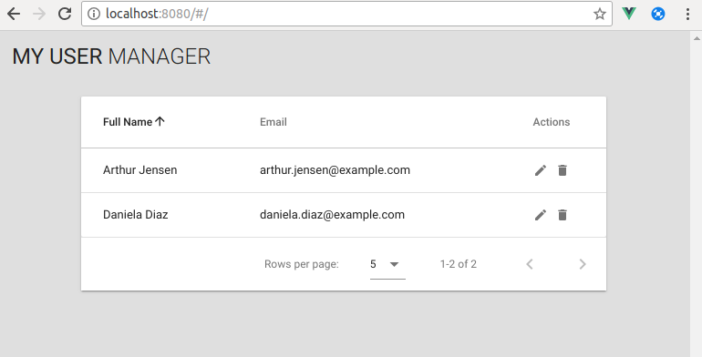

# Listado de Usuarios

# Descripción

Se va a componer una tabla que muestre el listado de usarios del recurso `users` del servicio REST publicado en la dirección,

https://my-user-manager.herokuapp.com/api-docs/



Se empleará el componente `<v-data-table>` de vuetify.



## Desarrollo

### Definir store

Primero vamos a reestructurar el store generado automáticamente. Para ello, creamos la carpeta `src/store`, moveremos el fichero `store.js` a la carpeta y se renombrará a `index.js`.

#### Módulo `userList`

Creamos el módulo del listado de usuario (`src/store/usersList.js`).

**src/store/usersList.js**
```javascript
const mockData = [
  {
    name: 'Daniela Diaz',
    email: 'daniela.diaz@example.com'
  },
  {
    name: 'Arthur Jensen',
    email: 'arthur.jensen@example.com'
  }
]

export default {
  namespaced: true,
  state: {
    list: undefined
  },
  mutations: {
    SET_LIST (state, list) {
      state.list = list
    },
    EMPTY_LIST (state) {
      state.id = undefined
    }
  },
  actions: {
    load ({ commit }) {
      return new Promise(resolve => {
        commit('SET_LIST', mockData)
        resolve()
      })
    }
  },
  getters: {
    items: state => state.list
  }
}
```

#### Store

Actualizamos el fichero `src/store/index.js` para cargar el módulo creado.

**src/store/index.js**

```javascript
import Vue from 'vue'
import Vuex from 'vuex'

import usersList from './usersList'

Vue.use(Vuex)

export default new Vuex.Store({
  modules: {
    usersList
  }
})
```

### Añadir Componente `UserList`

A continuación crearemos el componente `UserList` encargado de mostrar el listado de los usuarios. Para ello se crea el fichero `src/components/UsersList.vue`.

**src/components/UsersList.vue**

```html
<template>
  <h1>Users List</h1>
</template>
```

Se debe modificar `src/views/home.vue` para que cargue el componente `UsersList`.

```html
<template>
  <div class="home">
    <UsersList />
  </div>
</template>

<script>
// @ is an alias to /src
import UsersList from '@/components/UsersList.vue'

export default {
  name: 'home',
  components: {
    UsersList
  }
}
</script>
```



### Componente `UserList`

A continuación modificaremos el componente `UserList` para implementar las funcionalidades encargadas de mostrar el listado de los usuarios.

**src/components/UsersList.vue**

```html
<template>
  <v-data-table
    :headers="headers"
    :items="users"
    class="elevation-1"
  >
    <template slot="items" slot-scope="props">
      <td>{{ props.item.name }}</td>
      <td>{{ props.item.email }}</td>
      <td class="justify-center layout px-0">
        <v-icon
          small
          class="mr-2"
          @click="onEdit(props.item)"
        >
          edit
        </v-icon>
        <v-icon
          small
          @click="onRemove(props.item)"
        >
          delete
        </v-icon>
      </td>
    </template>
  </v-data-table>
</template>

<script>
export default {
  data () {
    return {
      headers: [
        {
          text: 'Full Name',
          align: 'left',
          sortable: true,
          value: 'name'
        },
        {
          text: 'Email',
          align: 'left',
          sortable: true,
          value: 'email'
        },
        {
          text: 'Actions',
          align: 'center',
          sortable: false
        }
      ]
    }
  },
  methods: {
    onEdit (user) {
      console.log('edit', user)
    },
    onRemove (user) {
      console.log('remove', user)
    }
  },
  computed: {
    users: {
      get () {
        return this.$store.getters['usersList/items']
      }
    }
  },
  mounted () {
    this.$store.dispatch('usersList/load')
  }
}
</script>
```



### Cargar datos del servicio REST

#### Instalar axios

Se utilizará `axios` para gestionar las peticiones HTTP, ya que nos permitirá utilizar las peticiones HTTP como `Promise`.

```shell
$ npm install --save axios
npm WARN ajv-keywords@2.1.1 requires a peer of ajv@^5.0.0 but none is installed. You must install peer dependencies yourself.
npm WARN optional SKIPPING OPTIONAL DEPENDENCY: fsevents@1.2.4 (node_modules/fsevents):
npm WARN notsup SKIPPING OPTIONAL DEPENDENCY: Unsupported platform for fsevents@1.2.4: wanted {"os":"darwin","arch":"any"} (current: {"os":"linux","arch":"x64"})

+ axios@0.18.0
added 1 package in 9.383s
```

#### Configuración de axios y carga de datos

Los datos del listado de usuario se sirven a través de la petición `GET /users`.


Se crea el fichero `api.js` para definir la configuración de la conexión.

**src/api.js**

```javascript
import axios from 'axios'

const instance = axios.create({
  baseURL: 'https://my-user-manager.herokuapp.com/'
})

export const getUsers = () => {
  return instance.get('/users')
}

export default instance
```

Y se actualiza el módulo del store para reemplazar los datos de prueba con los datos obtenidos de la petición `GET` definida.

**src/store/usersList.js**

```javascript
import { getUsers } from '@/api'

export default {
  ...
  state: {
    ...
    loading: false
  },
  mutations: {
    ...
    LOADING (state, value) {
      state.loading = value
    }
  },
  actions: {
    load ({ commit }) {
      commit('LOADING', true)
      return new Promise(resolve => {
        getUsers()
          .then(response => {
            commit('SET_LIST', response.data)
            commit('LOADING', false)
            resolve()
          })
      })
    }
  },
  getters: {
    ...
    loading: state => state.loading
  }
}
```

Se actualiza el componente para mostrar al usuario de forma visual que se están cargando los datos, para ello se emplea la propiedad loading del componente de vuetify,

**src/components/UsersList.vue**

```html
<template>
  <v-data-table
    ...
    :loading="loading"
  >
  ...
</template>
...
<script>
export default {
  ...
  computed: {
    ...
    loading: {
      get () {
        return this.$store.getters['usersList/loading']
      }
    }
  },
  ...
}
</script>
```


